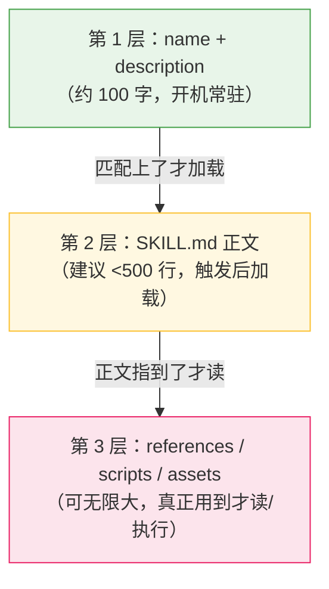
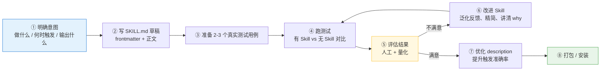
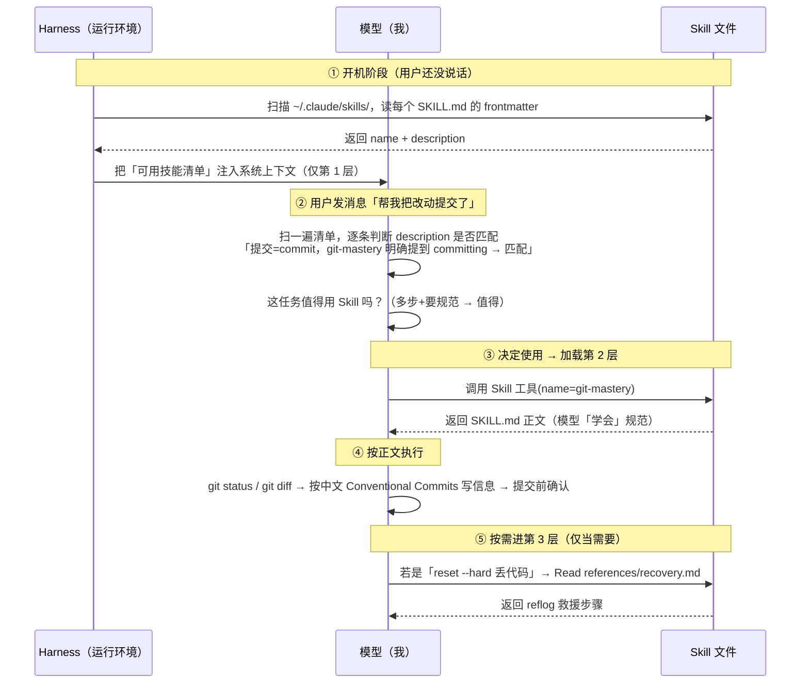
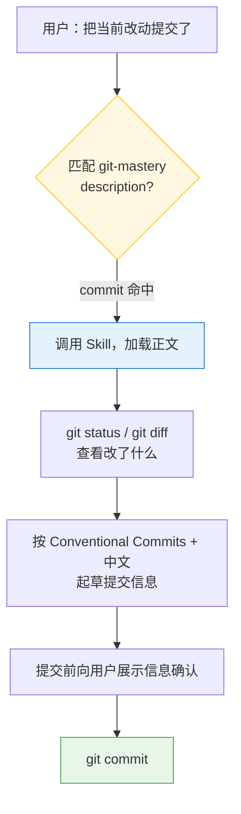

# Claude Skill 编写技巧分享

> 面向团队的实战分享文档。读完你应该能：理解 Skill 的工作原理 → 独立编写一个高质量 Skill → 避开常见坑。
> 全程以一个真实例子 **`git-mastery`** 贯穿讲解。
>
> 阅读提示：文中的流程图用 [Mermaid](https://mermaid.js.org/) 编写，GitHub / VS Code / Typora / 语雀均可直接渲染。

---

## 目录

1. [一句话理解 Skill](#1-一句话理解-skill)
2. [核心心智模型：三层渐进式加载](#2-核心心智模型三层渐进式加载难点)
3. [文件夹结构与责任分工](#3-文件夹结构与责任分工)
4. [编写主流程](#4-编写主流程)
5. [SKILL.md 解剖（以 git-mastery 为例）](#5-skillmd-解剖以-git-mastery-为例)
6. [触发原理：模型是怎么决定用不用的](#6-触发原理模型是怎么决定用不用的难点)
7. [写好 description 的技巧：对抗 undertrigger](#7-写好-description-的技巧对抗-undertrigger难点)
8. [示例验证：完整跑一遍 git-mastery](#8-示例验证完整跑一遍-git-mastery)
9. [避坑清单 & 自检 Checklist](#9-避坑清单--自检-checklist)
10. [进阶话题](#10-进阶话题)
11. [参考链接](#11-参考链接)

---

## 1. 一句话理解 Skill

**Skill 是一份「按需注入」给模型的说明书。**

模型本身是通用的——它不知道你团队的 Git 提交规范、不知道你要用中文写 commit。Skill 把这些**专门知识 + 操作流程**写成 Markdown 文件，在**需要的时候**塞进模型的上下文，让它临时「学会」按你的方式做事。

关键认知：

- Skill **不是代码、不是插件程序**，不会被「执行」。它就是**文字指令**。
- 它的难点不在「写」，而在「**它什么时候、怎么进入模型的脑子**」——这正是第 2、6 节要讲透的。

> 📖 官方文档：Agent Skills（见 [docs.claude.com](https://docs.claude.com/en/docs/claude-code/skills)）

---

## 2. 核心心智模型：三层渐进式加载【难点】

这是整个 Skill 体系**最重要**的设计，叫 **Progressive Disclosure（渐进式披露）**。

**为什么需要它？** 模型的上下文（context）是有限且按 token 计费的。如果把所有 Skill 的全部内容一直挂在模型脑子里，会让它变慢、变贵、还容易分心。所以 Skill 按「用到的概率」分三层，**层层按需加载**：



对应到 `git-mastery`：

| 层级 | 内容 | 何时进入上下文 | 成本 |
| --- | --- | --- | --- |
| **第 1 层** | `description`（"Use this skill for ANY git work…"） | 一开机就在 | 始终占用，必须短 |
| **第 2 层** | `SKILL.md` 正文（原则、提交规范、工作流） | 模型**决定调用它**的那一刻 | 触发时才占 |
| **第 3 层** | `references/recovery.md`（Git 救援手册） | 只有真出了 Git 事故、需要查救援步骤时 | 用到才占，99% 时间不加载 |

> 💡 **一句话记住**：平时只花 100 字成本让模型「知道有这么个 Skill」；又长又不常用的细节（如救援手册）推到第 3 层，绝大多数时候根本不加载。
>
> 延伸阅读：[YAML 多行字符串写法](https://yaml-multiline.info/)（frontmatter 里会用到）

---

## 3. 文件夹结构与责任分工

一个标准 Skill 就是一个文件夹，**`SKILL.md` 是唯一必需文件**，其余目录可选：

```
skill-name/
├── SKILL.md          【必需】入口文件，第 1+2 层都在这
├── references/       【可选】给模型「读」的资料（详细文档、长手册）
├── scripts/          【可选】给模型「跑」的代码（重复性、确定性任务）
└── assets/           【可选】输出时「用」的素材（模板、字体、图标）
```

三个可选目录的**责任分工**是初学者最容易混淆的点：

| 目录 | 定位 | 关键区别 | 例子 |
| --- | --- | --- | --- |
| `references/` | **读** | 模型用 Read 工具读进上下文 | API 文档、救援步骤、规范细则 |
| `scripts/` | **跑** | **不进上下文**，模型直接执行只看结果 | 解析 Excel、生成图表的 Python 脚本 |
| `assets/` | **用** | 不读不跑，直接作为产物素材 | docx 模板、Logo、字体文件 |

> ⚠️ **最容易踩的认知坑**：`scripts/` 是让模型**执行**而不是**阅读**的。
> 反例：一个处理 Excel 的 Skill，如果让模型每次现写解析代码 → 费 token 又容易出错。
> 正解：把脚本固化到 `scripts/`，模型直接 `python parse.py` 跑掉，又快又稳又可复用。

`git-mastery` 只用到了 `references/`（救援手册是「读」的资料），没用 `scripts/`，因为 Git 命令模型直接敲就行，不需要预置脚本：

```
git-mastery/
├── SKILL.md
└── references/
    └── recovery.md
```

**安装位置也是一种「分工」**：

| 位置 | 作用范围 | 适合 |
| --- | --- | --- |
| `~/.claude/skills/` | 个人全局，所有项目可用 | 通用能力（如 git-mastery） |
| `<项目>/.claude/skills/` | 仅该项目可用 | 项目专属规范 |
| 插件（plugin）内 | 随插件分发、受版本管理 | 团队共享、需要更新维护 |

---

## 4. 编写主流程



各步骤要点：

1. **明确意图**——动笔前先回答三问：
   - 这个 Skill 让模型**能做什么**？
   - 用户**说什么话**时该触发？（这直接决定 description 怎么写）
   - 期望**输出格式**是什么？
2. **写草稿**——先把 frontmatter 和正文写出来，不求完美。
3. **测试用例**——写 2~3 句**真实用户会说的话**，不是抽象指令。
4. **跑对比**——同一句话，分别用「带 Skill」和「不带 Skill」跑，差异才说明 Skill 的价值。
5. **评估**——主观看输出质量，客观看是否满足硬性断言（如「提交信息是否带 `feat:` 前缀」）。
6. **改进**——见第 9 节的原则：**从反馈中泛化**，别为了通过某个用例做过拟合的硬规则。
7. **优化 description**——单独的一步，专门提升「该触发时触发」的准确率（第 7 节）。
8. **打包/安装**——放到对应目录或打包成插件。

> 💡 输出主观的 Skill（写作风格、设计审美）可以跳过量化评估，靠人工判断即可；输出可客观验证的 Skill（文件转换、数据提取、固定流程）则强烈建议做测试用例。

---

## 5. SKILL.md 解剖（以 git-mastery 为例）

`SKILL.md` = **YAML frontmatter（头部元数据）** + **Markdown 正文**。

### 5.1 头部：frontmatter

```yaml
---
name: git-mastery
description: >-
  Use this skill for ANY git work in the user's daily development — running git
  operations (branching, committing, merging, rebasing...), explaining how git
  works..., enforcing the team's commit conventions, and recovering from broken
  states... Trigger it whenever the user mentions git, commits, branches...
  even if they don't say the word "git" explicitly (e.g. "save my changes",
  "undo that commit"). When in doubt, use it.
---
```

只有两个字段是关键：

- **`name`**：唯一标识，触发时点名用。
- **`description`**：**整个 Skill 最重要的一行**。因为第 1 层只有它常驻模型脑中，所以它是**唯一决定模型用不用这个 Skill 的依据**。详见第 7 节。

> 🔧 小知识：`>-` 是 YAML 的「折叠块标量」——允许把长描述换行写（好读），解析时换行被合并成空格变成一整句。参考 [yaml-multiline.info](https://yaml-multiline.info/)。

### 5.2 正文：body

正文是**给模型读的操作手册**，触发后整段进上下文。`git-mastery` 正文的结构与设计意图：

| 小节 | 作用 | 设计意图 |
| --- | --- | --- |
| 开头背景段 | 交代「用户做日常开发、要中文、用 Conventional Commits」 | 让模型**带着正确前提**干活 |
| Core operating principles | 哪些命令随便跑、哪些必须先确认 | **安全边界**——Git Skill 的灵魂 |
| Commit conventions | 类型表 + 规则 + 3 个中英对照例子 | 把「规范」变成可照抄的模板 |
| Common workflows | 提交/分支/同步/rebase/冲突 | 高频操作的标准做法 |
| Teaching & explaining | 用中文讲原理 | 覆盖「教学」用途 |
| Troubleshooting | **指路**到 `references/recovery.md` | 第 3 层的入口 |

注意最后一节**没有**把救援步骤全写进正文，而是写「去 `references/recovery.md` 读」——这就是渐进式加载的实操：**正文保持精简，长而不常用的细节推到第 3 层**。

### 5.3 两个写正文的好习惯（划重点）

**习惯一：讲「为什么」，而不只是「做什么」。**

```markdown
Git 几乎一切可逆——直到垃圾回收前几乎没有真正丢失的东西。
所以普通操作可以放心快做，只有少数会真正销毁工作的命令才需谨慎。
```

> 给模型**心智模型**，它就能灵活应对你没列到的情况，而不是死记硬背。
> 🚩 黄灯信号：如果你在狂写全大写的 `MUST` / `NEVER`，多半说明你在用规则压制而非用道理说服——试着换成解释「为什么重要」。

**习惯二：用例子代替空话。**

```markdown
Input: 给登录接口加了 JWT 鉴权
Output: feat(auth): 添加 JWT 登录鉴权
```

> 输入输出对照，比抽象规则有用得多。

---

## 6. 触发原理：模型是怎么决定用不用的【难点】

这是大家最好奇的部分。**触发不是写死的关键词匹配，而是模型在「推理判断」。**

以用户说「**帮我把改动提交了**」为例，全过程：



三个关键结论：

1. **第 1 层永远在线**：模型一开机就「知道」有哪些 Skill，但只知道它们的 `name + description`。
2. **匹配靠推理**：模型读你的话，**用语义判断**哪条 description 吻合——所以 description 写得像不像人话、覆盖不覆盖你的说法，直接决定判断准不准。
3. **还有一道隐性门槛**：任务得「值得」用 Skill。一句话能答的简单问题（如「git 是什么」）模型可能直接答了不调 Skill；多步、要按规范的（提交/救援/解冲突）才会调。

---

## 7. 写好 description 的技巧：对抗 undertrigger【难点】

模型有个天然倾向叫 **undertrigger**——该用 Skill 时却没用（嫌「我自己也能答」）。description 的首要任务就是对抗它。

**写法套路：description 里塞两类信息**

1. **做什么**：能力清单（git-mastery：运行 git 操作 / 解释 / 强制规范 / 救援）。
2. **何时触发**：触发场景越具体越好——
   - 关键词：`commit / branch / rebase / merge / reflog / HEAD`
   - **口语化、不提关键词的说法**：`"save my changes"`、`"undo that commit"`、`"我的仓库怎么这么乱"`
   - 兜底句：`"When in doubt, use it."`

**对比一下**：

```diff
- description: How to do git stuff.
+ description: >-
+   Use this skill for ANY git work — committing, branching, rebasing, resolving
+   conflicts, recovering lost commits... Trigger even when the user doesn't say
+   "git" (e.g. "save my changes", "undo that commit"). When in doubt, use it.
```

> ✅ 上面那条会在「帮我提交」「撤销刚才那次」这类口语下稳定触发；下面那条几乎不会触发。

**但也别 overtrigger（乱触发）**：description 要划清边界。写 negative 场景同样重要——比如一个 PDF Skill 应说明「不处理 Word/Excel」，避免抢不该它管的活。

> 🔧 进阶：可以用「触发评估集」（一批 should-trigger / should-not-trigger 的真实 query）量化测试 description 的准确率，再迭代优化。这属于 skill-creator 的能力范畴。

---

## 8. 示例验证：完整跑一遍 git-mastery

下面是一次真实交互的「应当表现」，用来验证 Skill 是否按预期工作。

**场景**：用户在一个有未提交改动的仓库里说：

> 「把当前改动提交了」

**期望的模型行为（逐步）**：



**验证点（可作为测试断言）**：

| # | 断言 | 通过标准 |
| --- | --- | --- |
| 1 | 提交前先看了 status/diff | 调用了 `git status` 或 `git diff` |
| 2 | 提交信息符合 Conventional Commits | 形如 `feat(...): …` / `fix: …` |
| 3 | 描述部分是中文 | 冒号后是中文 |
| 4 | 危险操作有确认 | 若涉及 `reset --hard` 等会先询问 |

**对比基线（不带 Skill）**：模型可能直接 `git commit -m "update"`，信息随意、无规范、可能用英文——这正是 Skill 带来的差值。

**第二个场景——验证第 3 层加载**：

> 「我不小心 `git reset --hard` 了，代码没了怎么办？」

期望：模型在正文 Troubleshooting 一节看到指路 → `Read references/recovery.md` → 给出 **reflog 救援**步骤（`git reflog` 找回 HEAD → `git reset --hard HEAD@{1}`）。**只有这种「出事」场景才会加载救援手册**，平时不加载——这就验证了渐进式加载生效。

---

## 9. 避坑清单 & 自检 Checklist

**改进 Skill 时的核心原则**（来自实战）：

1. **从反馈中泛化**：你只在两三个例子上迭代，但 Skill 要用一万次。别为通过某个用例写「过拟合」的硬规则，要提炼出通用模式。
2. **保持精简**：删掉不拉车的内容。读测试的过程记录（transcript），如果 Skill 害模型干了一堆无用功，就砍掉对应段落。
3. **解释 why**：用道理说服而非 `MUST` 压制。
4. **发现重复劳动就固化成 script**：如果多个用例里模型都独立写了相似的辅助脚本，就写一次放进 `scripts/`。

**发布前自检**：

- [ ] `SKILL.md` 存在且 frontmatter 有 `name` + `description`
- [ ] `description` 写清了「做什么」+「何时触发」，含口语化场景和兜底句
- [ ] 正文 < 500 行；超长内容已拆进 `references/`
- [ ] 关键操作给了**示例**（输入/输出对照）
- [ ] 解释了重要操作的「为什么」，没滥用全大写命令
- [ ] 重复性代码已固化到 `scripts/`（让模型跑，不是现写）
- [ ] 准备了 2~3 个真实测试用例并跑过对比
- [ ] 安装位置正确（个人全局 / 项目专属 / 插件）

> ⚠️ **生效时机坑**：正文（第 2、3 层）改完**下次触发即生效**；但 frontmatter（`name`/`description`，第 1 层）是**开机扫描**进去的，改完通常要**重启会话**才会刷新清单。

---

## 10. 进阶话题

- **Skill vs 插件（Plugin）**：一个完整插件除 Skill 外，还能携带斜杠命令、hooks（自动钩子）、子代理、MCP 服务器。Skill 只是其中一种组件。插件可通过市场（marketplace）分发并受版本管理（适合团队共享）；手工放 Skill 灵活但不受管理。
- **多领域 Skill 的组织**：当一个 Skill 要支持多个框架/平台时，按变体拆进 `references/`（如 `aws.md` / `gcp.md` / `azure.md`），模型只读相关的那份。
- **量化评估与基线对比**：用「带 Skill vs 不带 Skill」的并行测试 + 断言打分，得到 pass rate / 耗时 / token 的量化对比，避免凭感觉迭代。
- **description 自动优化**：用触发评估集跑优化循环，自动迭代出触发准确率更高的 description。
- **打包分发**：可将 Skill 文件夹打包成 `.skill` 文件供他人安装。

> 以上能力大多由官方的 **skill-creator** Skill 提供，建议团队统一用它来创建/迭代 Skill。

---

## 11. 参考链接

| 主题 | 链接 |
| --- | --- |
| Agent Skills 官方文档 | https://docs.claude.com/en/docs/claude-code/skills |
| Conventional Commits 规范 | https://www.conventionalcommits.org/ |
| YAML 多行字符串（frontmatter） | https://yaml-multiline.info/ |
| YAML 规范 | https://yaml.org/spec/ |
| Mermaid 流程图语法 | https://mermaid.js.org/ |
| git reflog（救援核心） | https://git-scm.com/docs/git-reflog |

---

> 📌 **一页速记**
> - Skill = 按需注入的说明书，本质是文字，不是程序。
> - 三层加载：`description`（常驻）→ 正文（触发后）→ references/scripts/assets（用到才加载）。
> - 文件夹分工：`references` 读、`scripts` 跑、`assets` 用。
> - 触发靠模型**语义推理** + 任务「值得」门槛，不是关键词匹配。
> - `description` 决定一切触发：写足「何时触发」、含口语场景、加兜底句。
> - 正文讲 why、给例子、保持精简；长内容下沉到第 3 层。
